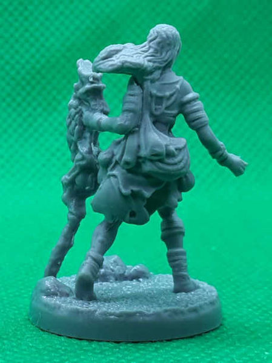
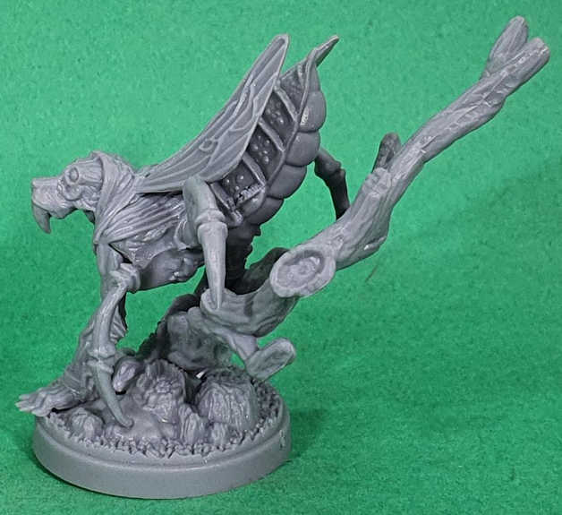
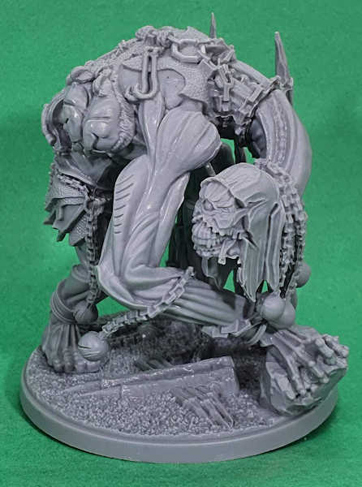
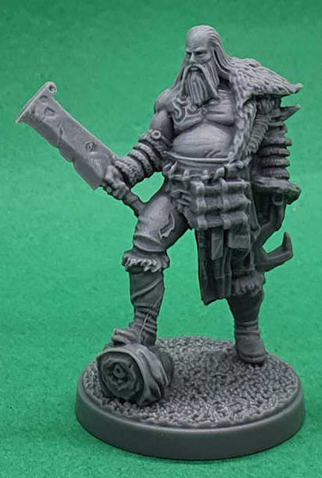
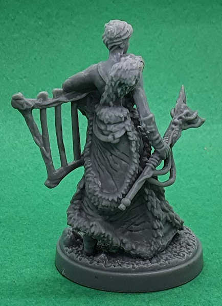

# Figurki

Poniższe zestawienie dotyczy wersji Kickstarterowej gry. Wersje sklepowe mają czesto mniej figurek.

### Upadek Awalonu (The Fall of Avalon)

Przód | Tył | Nazwa Angielska | Nazwa Polska
-- | -- | -- | --
 |  | Beor | Beor
 |  | Ailei | Ailei
 |  | Arev | Arev
 |  | Maggot | Czerw
 |  | Fore-Dweller | Pierwszy
 |  | Menhir 1 | Menhir 1
 |  | Menhir 2 | Menhir 2
 |  | Menhir 3 | Menhir 3
 |  | Niamh | Niahm

### Monsters of Avalon

Przód | Tył | Nazwa Angielska | Nazwa Polska
-- | -- | -- | --
 |  | Underbrush Wyrm | Żmij Leśny, Żmij Zaroślowy
 |  | Slaugh | Slaugh
 |  | Hammerbeak | Młotodziób
 |  | Wolfwalker | Wilcze Truchło
 |  | Wyrmtangle | Żmijowisko
 |  | Wyrdbear | Dziwdźwiedź
 |  | Wypaczony Jeleń
 |  | Wyrdchild | Dziecię Dziwu
 |  | Fore-Dweller Reclaimer | Dziwotwórca
 |  | Dullahan | Dullahan
 |  | Mulchman | Leśne Licho
 |  | Mistbearer | Mgielec
 |  | Knight Errant | Błędny Rycerz
 |  | Selkie | Selkie
 |  | Angry Mob | Rozjuszony Tłum
 |  | Warped One | Wypaczeniec
 |  | Bowmaiden | Łowczyni
 |  | Child of Morrigan | Dziecię Morrigan
 |  | Lost Knight | Zatracony Rycerz
 |  | Hellpig | Piekielny Dzik

### Monsters of Avalon - Past and Future

Przód | Tył | Nazwa Angielska | Nazwa Polska
-- | -- | -- | --
 |  | Doomwing | Skrzydlata Zguba
 |  | Wyrmlings | Skolopendrzec
 |  | Torch Bearer | Powierniczka Ognia
 |  | Kelpie | Kelpie
 |  | Horned Warden | Rogaty Opiekun
 |  | Aillén Trechend | Aillén Trechend
 |  | Pale Lady | Blada Pani
 |  | Dearg Due | Dearg Due
 |  | Allfather's Inquisition | Inkwizycja Wszechojca
 |  | Hooded Crow | Zakapturzona Wrona
 |  | Gigelorum | Gigelorum
 |  | Glastig | Glastig
 |  | Bean-Chioch | Bean-Chioch
 |  | Fachan | Fachan
 |  | Orphraned Heart | Osierocone Serce
 |  | Manipede | Pleń
 |  | Unchained Warbeast | Bojowa Bestia
 |  | Corrupted Druid | Spaczony Druid
 |  | Fuathan | Fuathan
 |  | Mad Warrior | Oszalały Wojownik

### Towarzysze (Companions)

Przód | Tył | Nazwa Angielska | Nazwa Polska
-- | -- | -- | --
 |  | Feral Cat | Dziki Kot
 |  | Lucky Piglet | Szczęśliwy Prosiaczek
 |  | Old Crow | Stary Kruk
 |  | Mysterious Badger | Tajemniczy Borsuk
 |  | Pack Donkey | Osioł

### Wiek Legend (The Age of Legends)

Przód | Tył | Nazwa Angielska | Nazwa Polska
-- | -- | -- | --
 |  | Naazer | Naazer
 |  | Caolin | Caolin
 |  | Duana | Duana
 |  | Thebald | Thebald

### Ostatni Rycerz (The Last Knight)

Przód | Tył | Nazwa Angielska | Nazwa Polska
-- | -- | -- | --
 |  | Fyul | Fyul
 |  | Dagan | Dagan
 |  | Mabd | Mabd
 |  | Sloan | Sloan

### Czerwony Mór (The Red Death)

Przód | Tył | Nazwa Angielska | Nazwa Polska
-- | -- | -- | --
 |  | Plaguebeast | Bestia Plagi
 |  | Fomorian Sentinel | Fomoriański Wartownik
 |  | Danse Macabre | Danse Macabre
